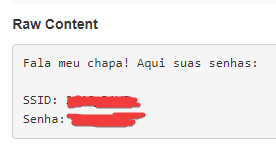

# Wifi-Stealer

> Repositório para fins educacionais. Utilize por sua conta e risco.

## Ajustes e melhorias

O projeto ainda está em desenvolvimento e as próximas atualizações serão voltadas nas seguintes tarefas:

- [x] Roubar os dados

- [x] Gerar um arquivo com isso

- [x] Enviar os arquivos via Webhook

- [ ] Enviar os arquivos via e-mail

- [ ] Conseguir utilizar em Bad-USB

## 💻 Pré-requisitos

Antes de começar, verifique se você atendeu aos seguintes requisitos:

• Você instalou a versão mais recente de `<Python / Subprocess / OS / Requests>`

• Deve-se instalar em sua máquina apenas o `<Python>`, os outros requisitos são bibliotecas que devem ser instaladas utilizando `pip install <nome_da_biblioteca>`

• Você tem uma máquina `<Windows / Linux>`.

## 🚀 Instalando Wifi-Stealer

Para instalar o wifi-stealer, siga estas etapas:

• Clique em `code`;

• Clique em `Download ZIP`;

• Extraia o projeto;

• No seu terminal utilize o comando `pip install <nome_da_biblioteca>` conforme os pré-requisitos.

## ☕ Usando o Wifi-Stealer

Para usar o Wifi-Stealer corretamente, siga estas etapas:

• Vá em `webhook.site`;

• Copie o conteúdo que está abaixo de `Your unique URL`;

• Aba o arquivo `stealer.py`;

• Substitua `seu_webhook_aqui` para sua `URL única`;

• Rode o script e seja feliz!

## 📫 Contribuindo com o projeto
Para contribuir com Wifi-Stealer, siga estas etapas:

1. Bifurque este repositório.

2. Crie um branch: `git checkout -b <nome_branch>`.

3. Faça suas alterações e confirme-as: `git commit -m '<mensagem_commit>'`

4. Envie para o branch original: `git push origin Wifi-Stealer / <local>`

5. Crie a solicitação de pull.

Como alternativa, consulte a documentação do GitHub em [como criar uma solicitação pull](https://help.github.com/en/github/collaborating-with-issues-and-pull-requests/creating-a-pull-request).